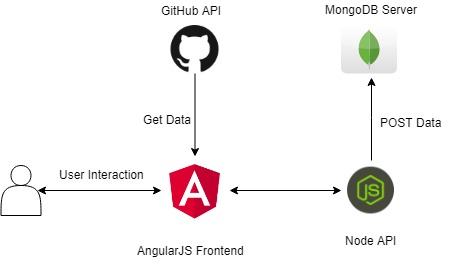

[](https://gitter.im/scorelab/scorelab?utm_source=badge&utm_medium=badge&utm_campaign=pr-badge&utm_content=badge) [](https://raw.githubusercontent.com/scorelab/stackle/master/LICENSE) [](https://travis-ci.org/scorelab/Stackle)


# Introduction
Stackle is a web communication portal aimed at providing Open Source organizations a platform to have discussions on their GitHub projects and their issues. It provides GitHub integration which allows the administrator of an organization to create a forum thread for the particular organization. Users signing in are able to view forums of the organizations they contribute to and engage in the forum discussions.

# Implementation Details
MEAN stack is used for developing Stackle. 
 - Front-End is developed using Angular
 - Back-end is handled by NodeJS using Express
 - MongoDB is used as the databases for storing data related to stackle

# Architecture
Users interact with the application through the Angular front-end which communicates with Node-API to get and post data to the MongoDB server. The front-end also communicates with GitHub API to get data related to Users, repositories and organizations. Users can login to the application through auth0 login integrated to Stackle.


***

# Setting Up the Project
These are the instructions on how to setup the project locally.

## Pre-requisites
* NodeJS 6.X or higher
* MongoDB Community edition

## Installing MongoDB

### On Windows
1. Download the lastest production release of MongoDB (3.4.6 or higher) from [here](https://www.mongodb.com/download-center#community).
2. Create the data directory to store all data. Create a the directory on the drive from which you start MongoDB. (Ex: If you are starting the MongoDB from the drive 'C'. You should create the directory as C:\data\db\ ).
3. To start the MongoDB, fire up a command line and run **mongod.exe** (ex: "C:\Program Files\MongoDB\Server\3.4\bin\mongod.exe" )
4. To connect to the MongoDB, use the **mongo.exe** shell. For that open up a command line an run *mongo*. (Ex: "C:\Program Files\MongoDB\Server\3.4\bin\mongo.exe" ).

For more information refer the [MongoDB manual](https://docs.mongodb.com/manual/administration/install-community/) on installing MongoDB Community edtion.

### On Mac

1. Download the binary files for the desired release of MongoDB.
Download the binaries from the [MongoDB Download Center](www.mongodb.com/download-center).
2. Extract the files from the downloaded archive.
For example, from a system shell, you can extract through the tar command:
```tar -zxvf mongodb-osx-ssl-x86_64-3.6.3.tgz```
3. Copy the extracted archive to the target directory.
Copy the extracted folder to the location from which MongoDB will run.
```mkdir -p mongodb```
```cp -R -n mongodb-osx-ssl-x86_64-3.6.3/ mongodb```
4. Ensure the location of the binaries is in the PATH variable.
The MongoDB binaries are in the bin/ directory of the archive. To ensure that the binaries are in your PATH, you can modify your PATH.
For example, you can add the following line to your shell’s rc file (e.g. ~/.bashrc):
```export PATH=<mongodb-install-directory>/bin:$PATH```
Replace <mongodb-install-directory> with the path to the extracted MongoDB archive.

## On Linux
For Ubuntu,SUSE, and Debian systems, you can install mongoDB Community Edition using .deb packages. The process varies from distro to distro, so I suggest you visit the link below, select your distribution.

Ubuntu terminal command:
`sudo apt-get update
sudo apt-get install -y mongodb-org`
Debian terminal command:
`sudo apt-get update
sudo apt-get install -y mongodb-org`
SUSE terminal command:
`sudo zypper -n install mongodb-org`

https://docs.mongodb.com/manual/administration/install-on-linux/

## Stackle API
1. `cd` in to the **stackle_api** directory.
2. Run `npm install` to install the packages required. 
3. Once all the packages are installed run `npm start`

## Stackle App
Make sure you have the [angular-cli](https://cli.angular.io/) installed. 
1. `cd` in to the **stackle-app** directory
2. Run `npm install` to install the packages required.
3. Once all the packages are installed, run `npm start` or `ng serve -o`

## Running Tests (Protractor)
1. Run `npm install -g protractor` to install protractor globally.
2. To get started with a Selenium Server, run
   ```
   webdriver-manager update
   webdriver-manager start
   ```
3. `cd` in to **root** directory and run `./ui-tests.sh`
4. To add more tests, edit **stackle_tests.js** located in **stackle_app**

# Running with Docker
1. Change the url in the database config file in stackle_api/config/database.js  as `url : 'mongodb://mongo:27017/stackle'`
2. In the root of the Stackle directory, run `docker-compose build`
   - If you are on Linux machine, execute the following steps to install compose. 
     ```
     sudo curl -L https://github.com/docker/compose/releases/download/1.17.0/docker-compose-`uname -s`-`uname -m` -o /usr/local/bin/docker-compose
     sudo chmod +x /usr/local/bin/docker-compose
     ```
3. Once build completes, run `docker-compose up`
